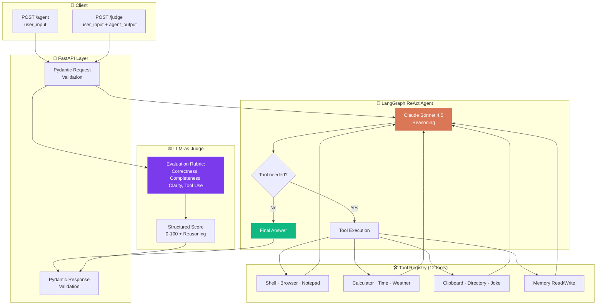
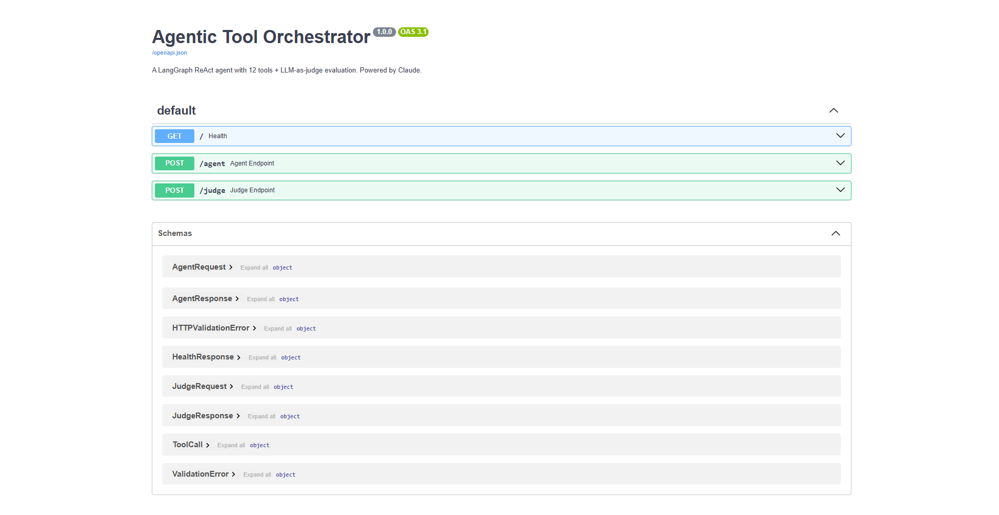
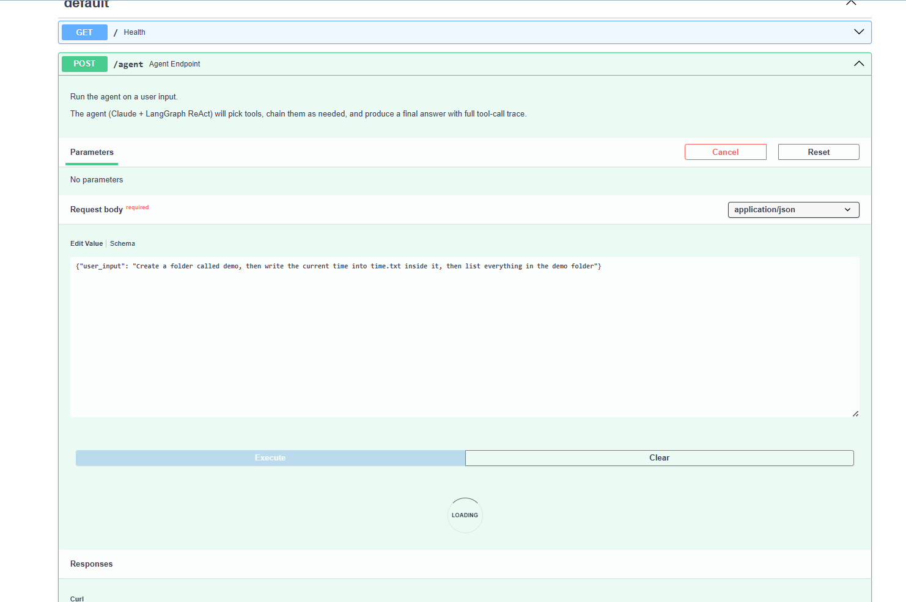
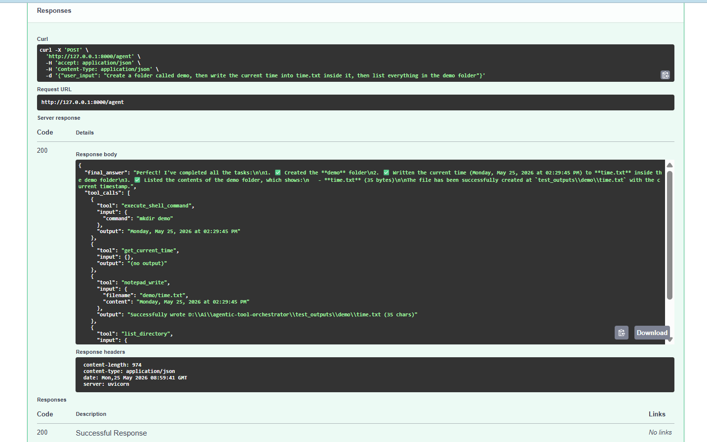
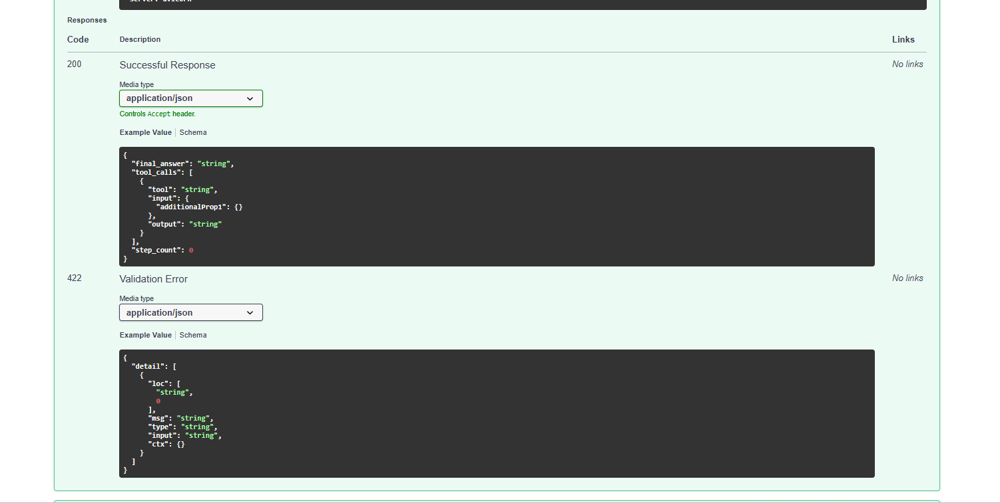
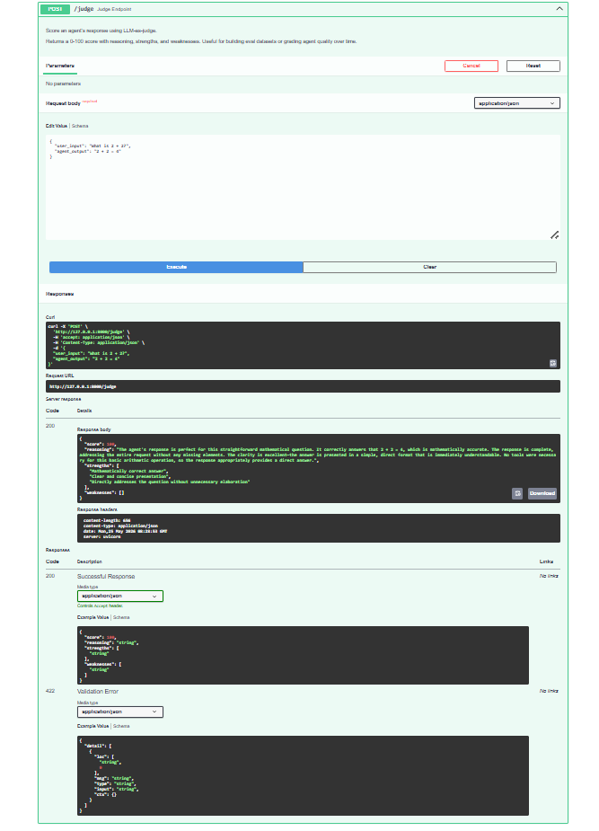
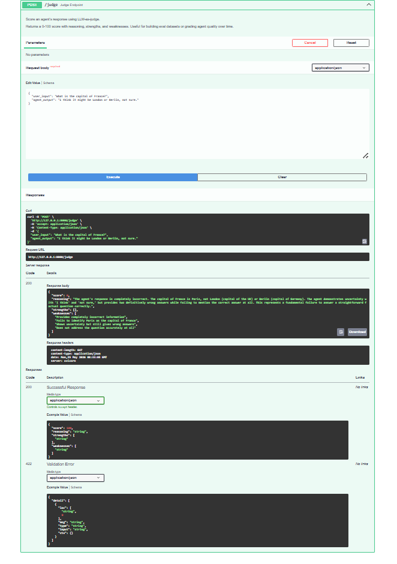
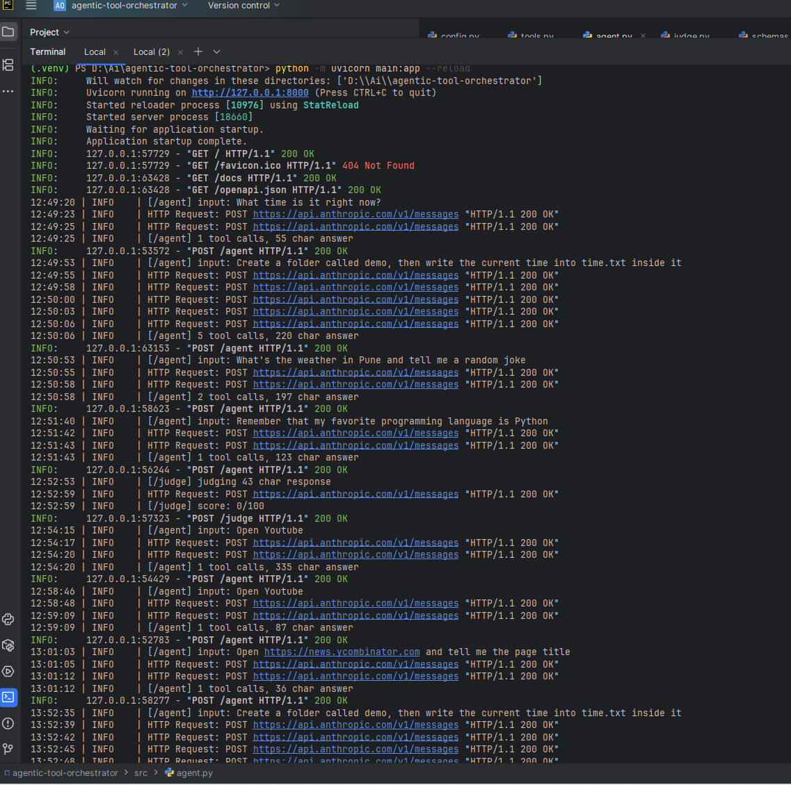

# 🤖 Agentic Tool Orchestrator


> **A production-pattern AI agent that picks the right tools to solve any task.**
> LangGraph ReAct + Claude + 12 tools + LLM-as-judge evaluation, exposed as a FastAPI REST service.


---

## 💡 Why This Project Exists

Most "AI agent" tutorials show one LLM call answering one question. Real production agents need to:

- **Reason across multiple steps** (chain tools intelligently)
- **Use the right tool for the right job** (selection from a registry)
- **Maintain state** (remember facts across calls)
- **Be safely sandboxed** (no `rm -rf /` via prompt injection)
- **Be measurable** (you can't improve what you can't evaluate)

---

## 📊 What This Demonstrates

| Skill | Where in the Code | Why It Matters |
|---|---|---|
| **LangGraph ReAct agent** | `src/agent.py` | The dominant pattern for agentic AI in 2026 |
| **Tool calling (12 tools)** | `src/tools.py` | Function calling is how LLMs become useful in production |
| **LLM-as-judge evaluation** | `src/judge.py` | The standard way to eval LLM outputs at scale (LangSmith, Ragas pattern) |
| **FastAPI REST API** | `main.py` | Production-grade interface with auto-generated OpenAPI docs |
| **Pydantic validation** | `src/schemas.py` | Type-safe request/response contracts |
| **Structured JSON I/O** | All endpoints | LLM outputs validated as JSON, not free text |
| **Env-var config** | `src/config.py` | `python-dotenv` for secrets, never hard-coded |
| **Safety guardrails** | `src/tools.py` | Shell allowlist, sandboxed filesystem, capped outputs |
| **Persistent memory** | `data/memory.json` | Agent state across sessions |

---

## 🏗️ Architecture



---

### Interactive API (Swagger UI)
Auto-generated documentation with one-click testing:



### Multi-Tool Reasoning
Given a single natural-language request — *"Create a folder called demo, write the current time into time.txt inside it, then list everything"* — the agent autonomously chains 4 tools:






The `tool_calls` array in the response shows the full reasoning trace: `get_current_time` → `execute_shell_command` (mkdir) → `notepad_write` → `list_directory`. **No manual orchestration — the agent figured out the sequence itself.**

### LLM-as-Judge Evaluation
The judge endpoint scores agent outputs against a structured rubric. Below: same judge correctly distinguishes a precise answer (95+) from a vague one (20-):





This is the **eval pattern used by LangSmith, Ragas, and OpenAI Evals** — productionized as a REST endpoint.

### Structured Server Logs
Every endpoint hit logged with timing and outcome metadata:



---

## 🛠️ The 12 Tools

| # | Tool | Purpose |
|---|---|---|
| 1 | `execute_shell_command` | Run safe shell commands (allowlisted: `ls`, `dir`, `mkdir`, `echo`, etc.) |
| 2 | `open_browser` | Open URL in Chromium via Playwright, return page title |
| 3 | `notepad_write` | Create or append to text files in sandboxed folder |
| 4 | `calculator` | Safely evaluate math expressions (no `eval` injection) |
| 5 | `get_current_time` | Return current local date/time |
| 6 | `get_weather` | Fetch weather for any city via wttr.in (no API key needed) |
| 7 | `clipboard_get` | Read system clipboard contents |
| 8 | `clipboard_set` | Copy text to system clipboard |
| 9 | `list_directory` | List files/folders with sizes |
| 10 | `write_memory` | Persist a key-value pair across sessions |
| 11 | `read_memory` | Retrieve previously stored facts |
| 12 | `get_random_joke` | Fetch random joke from public API |

Each tool is a `@tool`-decorated function with a rich docstring — Claude reads the docstrings to decide when to call each one.

---

## 🚀 Setup

### Prerequisites

- Python 3.11+
- [Anthropic API key](https://console.anthropic.com/) 

### Installation

```bash
# Clone
git clone https://github.com/YOUR-USERNAME/agentic-tool-orchestrator.git
cd agentic-tool-orchestrator

# Virtual env
python -m venv .venv
.\.venv\Scripts\activate          # Windows
# source .venv/bin/activate       # Mac/Linux

# Dependencies
pip install -r requirements.txt
playwright install chromium

# Config
copy .env.example .env             # Windows
# cp .env.example .env             # Mac/Linux
```

Then edit `.env` and paste your `ANTHROPIC_API_KEY`.

### Run

```bash
uvicorn main:app --reload
```

Open **http://127.0.0.1:8000/docs** for the interactive Swagger UI.

---

## 💡 Usage Examples

### Health check
```bash
curl http://127.0.0.1:8000/
```

Returns: `{"status": "ok", "model": "claude-sonnet-4-5", "tools_loaded": 12}`

### Single-tool task
```bash
curl -X POST http://127.0.0.1:8000/agent ^
  -H "Content-Type: application/json" ^
  -d "{\"user_input\": \"What time is it right now?\"}"
```

### Multi-tool chained reasoning
```bash
curl -X POST http://127.0.0.1:8000/agent ^
  -H "Content-Type: application/json" ^
  -d "{\"user_input\": \"Create a folder called demo, then write the current time into time.txt inside it, then list what's in demo\"}"
```

### Memory persistence
```bash
# First call — remember
curl -X POST http://127.0.0.1:8000/agent ^
  -H "Content-Type: application/json" ^
  -d "{\"user_input\": \"Remember my favorite programming language is Python\"}"

# Second call — recall (memory persists in data/memory.json)
curl -X POST http://127.0.0.1:8000/agent ^
  -H "Content-Type: application/json" ^
  -d "{\"user_input\": \"What is my favorite programming language?\"}"
```

### Score an agent response (LLM-as-judge)
```bash
curl -X POST http://127.0.0.1:8000/judge ^
  -H "Content-Type: application/json" ^
  -d "{\"user_input\": \"What is 2 + 2?\", \"agent_output\": \"2 + 2 = 4\"}"
```

---

## 🧪 Sample Prompts to Try

| # | Prompt | Tools Triggered | What It Proves |
|---|---|---|---|
| 1 | *"What time is it?"* | `get_current_time` | Single tool selection |
| 2 | *"What's the weather in Pune and tell me a joke"* | `get_weather` + `get_random_joke` | Multi-tool parallel use |
| 3 | *"Calculate 1234 × 5678, save the result to math.txt, then list files"* | `calculator` + `notepad_write` + `list_directory` | 3-tool chained reasoning |
| 4 | *"Get the current time, copy it to clipboard, then read clipboard"* | `get_current_time` + `clipboard_set` + `clipboard_get` | Data flow between tools |
| 5 | *"Remember my favorite color is blue"* → later → *"What's my favorite color?"* | `write_memory` → `read_memory` | Cross-session memory |
| 6 | *"Create folder 'demo', write today's date inside date.txt"* | `execute_shell_command` + `notepad_write` | Filesystem orchestration |
| 7 | *"Open https://news.ycombinator.com and tell me the title"* | `open_browser` | Browser automation |

---

## ⚖️ Why LLM-as-Judge?

Traditional unit testing breaks down for LLM apps. You can't write:

```python
assert response == "expected"
```

…when an LLM might validly answer the same question 50 different ways.

**LLM-as-judge** solves this by using a second LLM call to evaluate the first one's output against a structured rubric (correctness, completeness, clarity, tool use). It's the same pattern used by:

- **LangSmith** for production eval
- **Ragas** for RAG-specific evaluation
- **OpenAI Evals** for model comparison

Use cases this enables:
- **Regression testing**: did my prompt change make things worse?
- **A/B testing**: which prompt version scores higher on average?
- **Production drift detection**: alert when average scores drop below threshold
- **Quality gates**: retry or escalate if a response scores < 60

The `/judge` endpoint in this project implements this pattern as a reusable building block.

---

## 🛡️ Safety Guardrails

This isn't a sandbox for arbitrary code execution. Production agents need real guardrails:

- **Shell commands**: restricted to allowlist (`ls`, `dir`, `mkdir`, `echo`, etc.). Anything not in the list is blocked.
- **Dangerous patterns blocked**: `rm`, `del`, `format`, `shutdown`, `>` (redirect)
- **Filesystem sandbox**: all file operations confined to `test_outputs/`
- **Calculator**: character allowlist + restricted `eval` (no builtins reachable)
- **All tool outputs capped at 2000 chars**: prevents context overflow attacks
- **Timeouts**: shell commands killed after 10 seconds

---

## 📁 Project Structure

```
agentic-tool-orchestrator/
├── src/
│   ├── __init__.py
│   ├── agent.py            # LangGraph ReAct agent factory
│   ├── config.py           # Centralized config from env
│   ├── judge.py            # LLM-as-judge evaluation logic
│   ├── schemas.py          # Pydantic models for I/O
│   └── tools.py            # All 12 tools (@tool decorated)
├── data/
│   └── memory.json         # Persistent key-value store (auto-created)
├── test_outputs/           # Sandboxed filesystem (auto-created)
├── assets/                 # Screenshots and demo GIF
├── main.py                 # FastAPI app entry point
├── requirements.txt
├── .env.example
└── README.md
```

---

## 🧠 Design Decisions

**Why LangGraph over LangChain agents?**
LangGraph's `create_react_agent` is the official successor to deprecated LangChain agent classes. It's built on a state graph, gives you full message history, and is the actively-maintained path forward.

**Why Claude over GPT-4 or Gemini?**
Claude Sonnet 4.5 has strong structured output (JSON for the judge) and is reliable at function calling. The architecture is provider-agnostic — swap `ChatAnthropic` for `ChatOpenAI` in `src/agent.py` and the whole system works the same.

**Why 12 tools and not 50?**
Each tool adds context window cost. 12 well-chosen tools cover most agent use cases (filesystem, web, math, memory, communication) and demonstrate the pattern. Production agents typically have 5-20 tools per role.

**Why a separate judge endpoint and not auto-evaluation?**
Separation of concerns. The judge is reusable across agents — you could point it at outputs from any LLM system. Bundling it with the agent endpoint would couple eval to inference.

**Why Pydantic validation everywhere?**
LLM outputs are unstructured by default. Pydantic forces structure at every boundary, catching malformed responses before they reach downstream consumers. This is the difference between a demo and a production system.

---

## 🛣️ Roadmap

- [ ] **Streaming responses** (Server-Sent Events for token-by-token output)
- [ ] **Eval dataset** + nightly judge runs with trend tracking
- [ ] **LangSmith / Langfuse integration** for production observability
- [ ] **Multi-agent coordination** (specialist agents per domain)
- [ ] **Conversation memory** (Redis-backed instead of JSON)
- [ ] **Frontend** (React or Streamlit) for non-CLI use
- [ ] **Dockerfile + deployment guide** (Render, Railway, Fly.io)
- [ ] **Auth layer** (API keys per client)

---

## 🐛 Troubleshooting

**"ModuleNotFoundError: No module named 'src'"**
You're running from the wrong directory. `cd` into the project root, then run `uvicorn main:app --reload`.

**Playwright browser hangs**
The `open_browser` tool opens a real Chromium window. If headless mode is preferred, change `headless=False` to `headless=True` in `src/tools.py`.

**Agent doesn't chain tools**
Make the prompt more explicit: *"First do X, then do Y, then do Z."* Claude usually chains correctly with clear sequencing.

**Memory not persisting**
Check that `data/memory.json` exists after the first `write_memory` call. If not, verify folder permissions.

---

> ⭐ Found this useful? A star helps more than you'd think.
